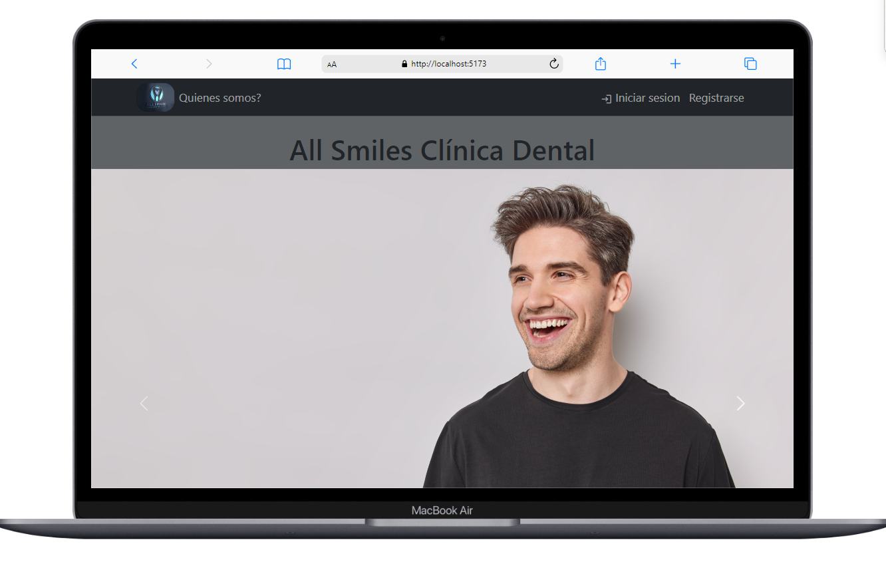
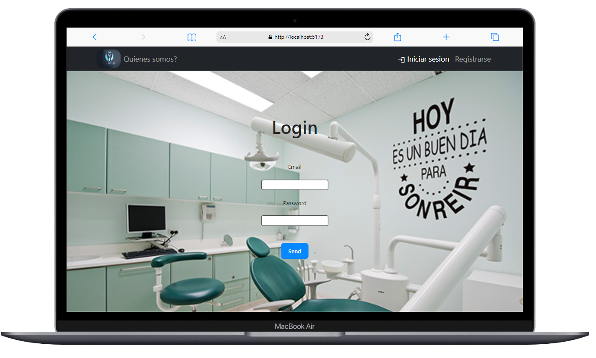
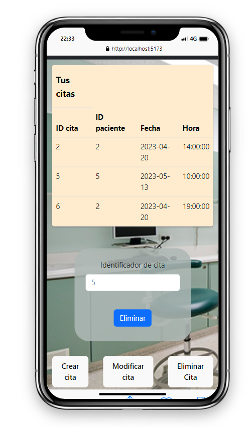
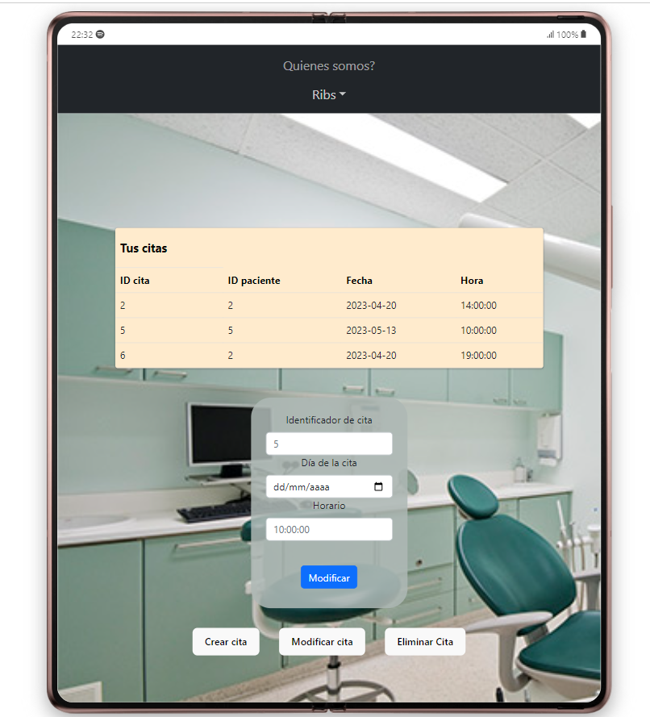
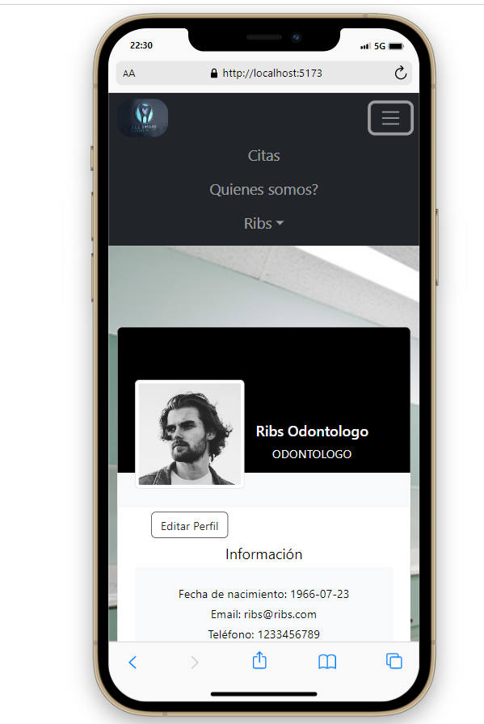

# All Smiles Clínica Dental

Este proyecto consiste en una página web front end conectada a una API backend con Base de Datos para la gestión de una clinica dental.

### Instalación:

- Clonar el repositorio: git clone https://github.com/FranciscoCampana1/clinicDentalFrontend
- Instalar las dependencias: npm install
- Iniciar el servidor de desarrollo: npm run dev

### Cómo usar el proyecto.

Navegar a la url en el navegador.

- Hacer clic en el botón "Iniciar sesión".
- Introducir las credenciales de usuario.
- Explorar las diferentes secciones de la aplicación.

### Imagenes

 A continuación se pueden ver imagenes del proyecto en pantallas small hasta extra large. 

### Nuevas Funcionalidades

Los usuarios van a poder colocar su imagen de perfil, van a poder conocer a sus médicos y tener una imagen de ellos antes de su cita. 

### Deploy

- React
- HTML
- CSS
- JavaScript

### Contacto

**_Francisco Campana_**  

